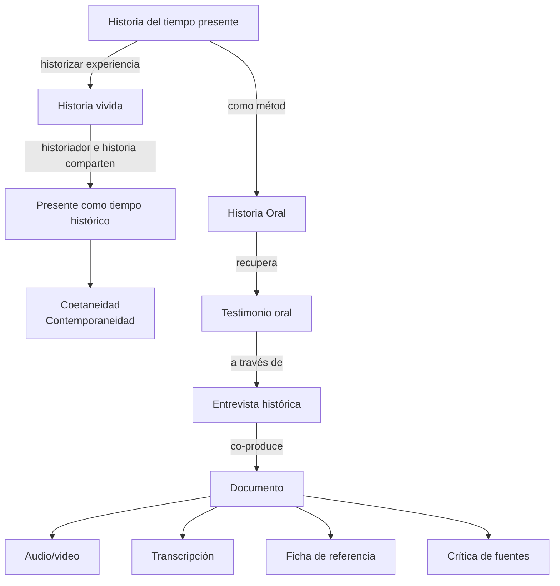

Diagrama de relación entre [[memoria e historia oral]]:

1. Todo conocimiento científico es discurso producido por los dispositivos que lo posibilitan
    - Paradigma (epistemología que implica teoría, método) y sujeto de conocimiento
2. No hay etnografía fuera del dispositivo etnográfico, ni historia fuera del dispositivo histórico
    - Conversaciones informales
    - Documento testimonial
3. Hay dispositivos que son contradictorios cuando se encuentran 
4. Si se cambia el punto de partida, por ejemplo, del objeto disciplinario al objeto interdisciplinario, cambia el dispositivo y el conocimiento producible por él

---

Reflexiones sobre la entrevista:

- La entrevista no siempre es necesaria
- Una forma de ver la entrevista es desde el punto de vista de la persona
    - El grado de intervención
    - La posición de autoridad epistétmica
    - 
