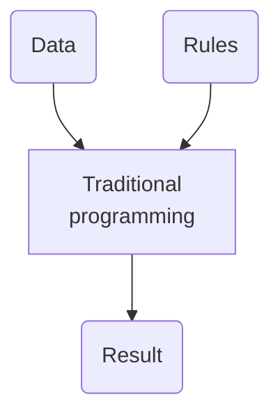
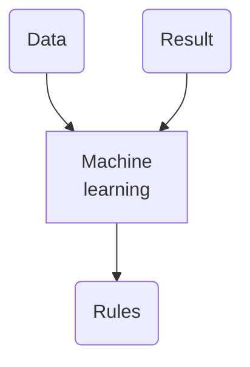

Un subconjunto de la [[inteligencia artificial]] basado en el entrenamiento de agentes artificiales de información a través de algoritmos.

Según el [curso de Google](https://youtu.be/_oF7z-6QU4o?si=ycZSWo4H-Jl1GlNq) sobre aprendizaje de máquinas En programación tradicional hay datos que se procesan con reglas escritas para producir un resultado predecible. 

El aprendizaje automático en cambio recibe datos y resultados para predecir las reglas:

Este último modelo corresponde al *aprendizaje supervisado*, ya que los resultados forman parte del entrenamiento, y son generalmente dados por humanos. Así, el aprendizaje puede ser supervisado, no supervisado (si sólo se dan los datos de entrada, no el resultado) o reforzado. 

En este contexto, un modelo es una representación de la realidad constituida por una serie de dimensiones que representan su complejidad, una serie de parámetros o valores ajustables, y una función de error que mide la relación de exactitud entre los datos y el modelo, típicamente, se calcula con el método de [[descenso del gradiente]].

Existen modelos como:

- Regresión lineal
- [[red neuronal artificial]]