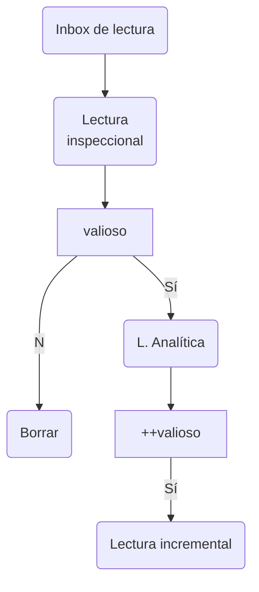

Un [[inbox]] para revisar los artículos, libros y referencias digitales y analógicas que  deberían estar en una sola carpeta `inbox-lectura`. Esa carpeta debería procesarse con 

```mermaid
graph TD
    A(Inbox de lectura) --> B("Lectura <br/> inspeccional")
    B --> valioso
    valioso --Sí--> C("L. Analítica")
    valioso --No--> D(Borrar)
    C --> E["++valioso"]
    E --Sí--> F("Lectura incremental")
```

