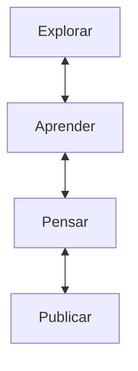
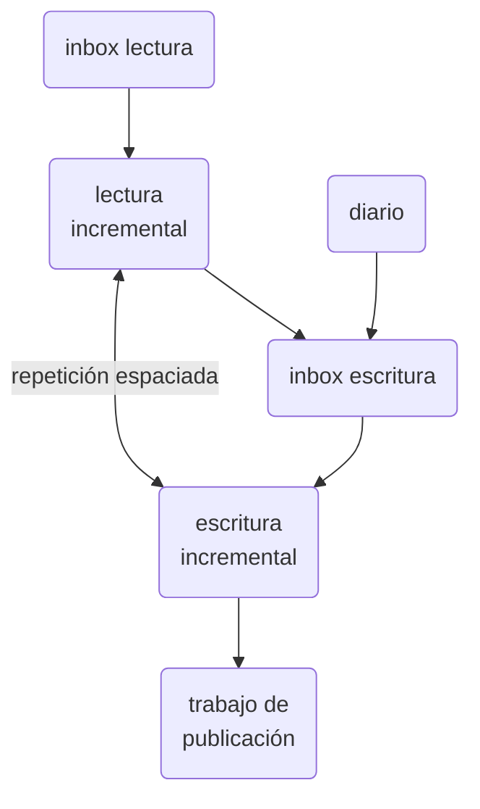

# Reflexiones sobre mi proceso de toma de notas

Después de 3 años de usar Obsidian y haber investigado metodologías como el [[zettelkasten de Luhman]] y el [[zettelkasten de @ahrens2017]] he llegado a varias conclusiones importantes:

**No confundir escribir notas con escribir textos finales**, yo lo he hecho todos estos años y sólo ha traído fricciones y complicaciones. Llegué al punto en que notas se volvieron casi irrelevantes y ya estaba de nuevo usando la técnica de leer-subrayar-escribir el texto final. He tratado las notas como pedazos de textos finales y por eso tiendo a despreciar tanto mis propias ideas (proposiciones iniciales o intuitivas) como otros tipos de notas: no conceptuales u orientadas al aprendizaje, la memoria, o los casos.

El texto final y la nota son dos momentos separados. Forzar la nota al texto final debilita su mayor ventaja: **ser un dispositivo para pensar mejor** ([[nota como herramienta cognitiva]]).

## Proceso actual

Creo que un sistema mínimo viable de [[gestión de conocimiento]] tiene un flujo como este:

Los primeros dos implican leer como actividad principal, los últimos dos implican escribir. Aunque todas involucran esas actividades básicas en varios modos.

Así que para cada tema o proyecto tengo que desarrollar esas cuatro prácticas de forma no lineal. Teóricamente hasta ahora tengo estos procesos para lograrlo:

### Paso a paso

- [[inbox de lectura]] para capturar cosas que me interesan pero no sé si son importantes hasta hacer una [[lectura inspeccional]]
- [[lectura incremental]] para cosas que sé que vale la pena explorar
    - Acá se crean la mayoría de notas de literatura 
        - Ver [[notas de referencia y literatura en Luhmann]]
        - Ver [[zettelkasten de @ahrens2017#Cómo crear notas de referencia / literatura]])
    - Después de años ya no creo que las notas deban ser como la prosa final. Las notas son un proceso totalmente independiente a la prosa publicable. **Las notas son sólo para pensar**.
- [[inbox de escritura]] basado en extractos procesados de mis notas diarias
- Sesiones de [[escritura incremental]]
    - Acá se crean las notas permanentes, que son atómicas
    - Ver [[zettelkasten de @ahrens2017#Cómo crear notas permanentes]]
- Sesiones de escritura para publicar (que es el trabajo de manuscritos, la corrección y publicación de textos).
    - Idealmente debería ser un proceso espaciado, como en la [[guía para la escritura académica según @ahrens2017]]
    - aquí me baso en [[técnicas de escritura rápida]] (falta elaboración en esa nota)

Diagramáticamente:

## Otras referencias
Ver también dos notas donde documento ideas y proceso al respecto:

- [[§ sistemas de notas]]
- [[log ztk]]
